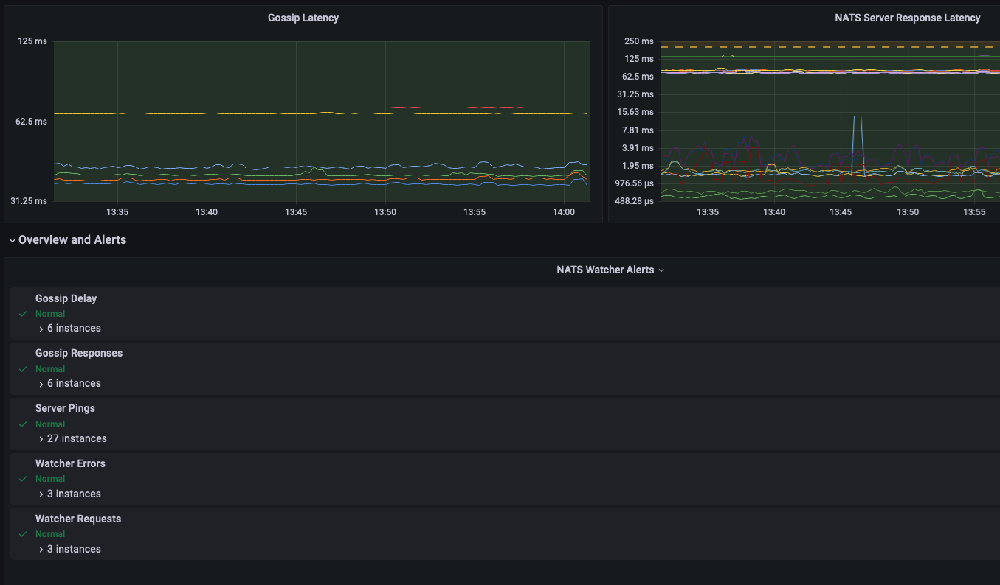

## NATS Watch

This is a system that can watch a [NATS](https://nats.io/) Cluster or Super Cluster and observe latency and availability from many locations.

Data is exposed as Prometheus Metrics and a dashboard is included.



## Monitoring Methods

There are 2 major modes of operation at the moment, details below.

### Watcher Gossip

Each watcher publishes a message every 500ms, the message has the sending timestamp embedded along with details
of the watcher that published it.

All other watchers listens for these Gossips and record the latency between publish time and received time.

Using the time since a gossip was last received outages can be identified and the latency can be used to identify
network latency issues.

### NATS Server Ping

Each watcher publishes a message to `$SYS.REQ.SERVER.PING` every 5 seconds, every server in the cluster responds. 
The replies are tracked and their response delay is measured.

Using the time since a response was last received server outages can be identified and the latency can be used to
identify network latency issues.

## Prometheus Metrics

In the metrics the `name` is the value set using `--name` flag and should be unique among watchers.

| Metric                                    | Description                                                                                           |
|-------------------------------------------|-------------------------------------------------------------------------------------------------------|
| `nats_watch_watcher_error_count`          | Overall count of all errors encountered                                                               |
| `nats_watch_nats_error_count`             | Number of times the nats error handler got called due to issues with the connection                   |
| `nats_watch_nats_disconnection_count`     | Number of times the nats connection disconnected                                                      |
| `nats_watch_nats_reconnection_count`      | Number of times the nats connection reconnected after a failure                                       |
| `nats_watch_nats_publish_error_count`     | Number of times publishing a message failed                                                           |
| `nats_watch_gossip_rtt`                   | The delay between a gossip message being published and it being received                              |
| `nats_watch_gossip_received_delay`        | A Summary containing delay information for gossip messages which includes the counts of messages      |
| `nats_watch_gossip_received_errors`       | Number of invalid messages received by the gossip listener                                            |
| `nats_watch_statsz_server_response_delay` | A Summary containing delay information for server ping responses which includes the count of messages |
| `nats_watch_statsz_server_response_count` | A count of server ping messages that was received                                                     |
| `nats_watch_statsz_requests_count`        | The number of server ping requests that were published                                                |
| `nats_watch_build_info`                   | Version information                                                                                   |

## Running

If your NATS Cluster is deployed in 3 regions you would deploy at least 1 watcher per region, they will automatically 
communicate with each other and track the latencies and more in the cluster.

You would need to get all the Prometheus metrics into the same Dashboard for reporting to make sense.

```nohighlight
$ nats-watch \
    --name US-WEST-1 \ # A unique name for the watcher 
    --context NW     \ # A NATS Context made using the nats CLI with connection information
    --listen 0.0.0.0 \ # Where to listen for Prometheus
    --port 8080      \ # The port to listen on for Prometheus
    --server-ping    \ # Enables server pings which requires a system account
```

Prometheus statistics are exposed on `/metrics` as usual.  The Prometheus Namespace defaults to `nats_watch` and can be
changed using `--ns`

There is a Docker container at [https://hub.docker.com/r/ripienaar/nats-watch](https://hub.docker.com/r/ripienaar/nats-watch).

## Grafana

A basic Grafana dashboard is included, this is a new dasbhoard that includes some Alerting rules, but it's still being worked on, feedback welcome.

## Status

This is a new project extracted from a customer deployment and made a bit more generic, feedback welcome.

## Contact

R.I. Pienaar / rip@devco.net / @ripienaar / @ripienaar@mostadon.social
